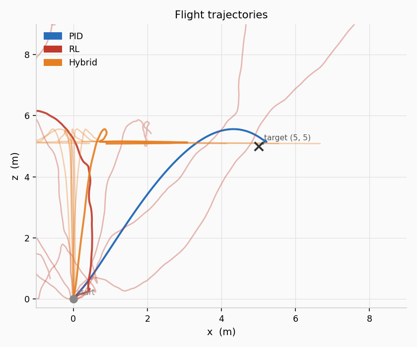
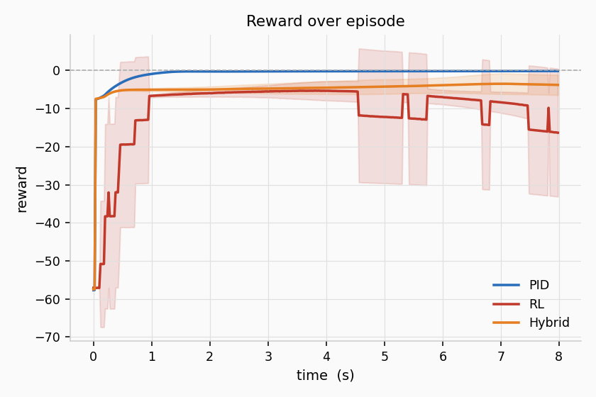
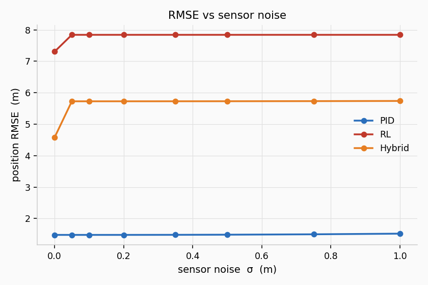

# Drone navigation with noisy sensors

**Mariia Osipova · Ingeniería en IA · UdeSA · April 2026**

---

## What this is

A small project comparing three approaches to controlling a simulated drone when the sensors aren't perfect. The drone has to fly from one point to another in 2D. The question is: does it help for the agent to know how uncertain it is, not just what it sees?

This is a proposal / work in progress. The PID baseline is running; the RL parts come next.

---

## The three approaches

**1. PID** — a hand-written controller with fixed rules. No learning. Noise is modeled as simulated wind.

**2. RL without belief** — a PPO agent that learns from raw noisy sensor readings, treating them as if they were ground truth.

**3. RL with belief** — same agent, but also receives an estimate of how much it can trust its sensors at each step.

---

## The question

> Does giving an agent information about its own uncertainty make it more robust when sensors are noisy?

If the belief-aware agent learns to move more carefully when uncertain, that's a practical sign the uncertainty signal is doing something useful.

---

## What we expect

| Noise level | PID | RL (no belief) | RL (with belief) |
|---|---|---|---|
| None | baseline | matches after training | matches after training |
| Moderate | degrades gradually | degrades faster | degrades more slowly |
| High | still functional | may fail abruptly | hopefully more robust |
| Unseen levels | consistent | poor generalization | better generalization |

These are hypotheses, not results yet.

---

## PID baseline outputs

Trajectories:

Reward:

RMSE across noise levels:

---

## Setup

The simulation is in `playground-pid-2d/python/`. It's a custom 2D drone physics sim with a PID altitude controller. The RL agents will use PPO on top of the same simulator.

The formal framing is a POMDP: the agent has a true state it can't observe directly, only noisy readings of it. The "belief" is a lightweight approximation — not a full Bayesian filter, just enough to test whether uncertainty awareness matters in practice.

---

*Stack: Python, custom 2D sim, PPO (planned)*
